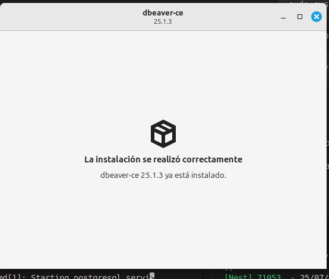

# Instalación y configuraciòn de postgres

## 🔄 1. Actualización del sistema

```
sudo apt update
sudo apt upgrade -y

```

## Instalaciòn de postgres en linux mint

```
sudo apt install -y postgresql postgresql-contrib

```

✅ Paso 4: Cambiar a usuario postgres para usar la CLI

```
sudo -i -u postgres
```

✅ Paso 5: Accede a la consola de PostgreSQL
```
psql
```

✅ Paso 6: Crear una base de datos y usuario (opcional)
```
CREATE DATABASE nestjs;
```
cambia la contraseña de usuario postgres
```
ALTER USER postgres WITH PASSWORD 'postgres'
```

Reiniciar el servicio 

```
sudo systemctl restart postgresql
```

## Descargar Dbeaver

```www
https://dbeaver.io/download/
```
Seleccionamos esta opciòn


### una vez descargado damos click derecho y seleccionamos instalador de paquetes



actualizamos los drives de dbeaver

###
Poder entrar a mi base de datos por consola u otras maquinas de red
```
 sudo nano /etc/postgresql/16/main/pg_hba.conf

```

Busca la lìnea : 
```
local   all             postgres                                peer

```
y cambiala a: 

```
local   all             postgres                                md5

```
Si no recuerdas la contraseña de postres cambia a: 
```
local   all             postgres                                trust
```

cambiar contraseña a usuario postgres

```
ALTER USER postgres WITH PASSWORD 'tu_nueva_contraseña_segura';
```

Reinicia postgres

```
sudo systemctl restart postgresql
```


CREATE TABLE IF NOT EXISTS public.users (
    id SERIAL PRIMARY KEY,
    name VARCHAR(100)  NULL,
    email VARCHAR(150)  NULL,
    role VARCHAR(30)  NULL,
    password VARCHAR(255) NULL,
    created_at TIMESTAMP DEFAULT CURRENT_TIMESTAMP,
    updated_at TIMESTAMP DEFAULT CURRENT_TIMESTAMP
);


## Body de peticiòn
{
"name":"administrador",
"email": "admin@gmail.com",
"role":"admin",
"password":"123456"

}
